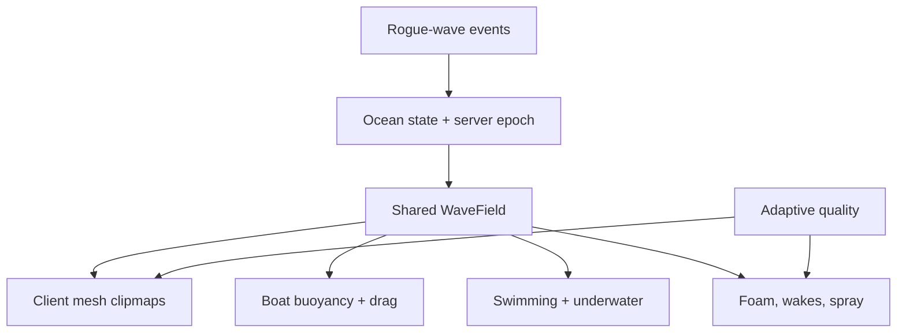

# Epic Ocean System for a Roblox Odyssey/Rogue Seafaring Game

**Implementation handoff for GPT-5.6 Luna Max using Roblox Studio MCP**  
**Research date:** 19 August 2026  
**Status:** Architecture and execution specification

---

## 1. Executive decision

Build a **client-rendered, camera-centred ocean made from fixed-topology `EditableMesh` geometry clipmaps**, deformed by a **deterministic, spectrum-authored Gerstner wave field**. Put all wave mathematics in one shared, pure Luau module and use that exact module for:

- visual vertex displacement;
- analytic surface normals and crest compression;
- boat buoyancy and hydrodynamic drag;
- swimming/underwater detection;
- projectile and creature interactions;
- wakes, whitecaps, storms, and scripted rogue-wave packets.

Use Roblox's PBR, realistic lighting, atmosphere, dynamic clouds, global wind, particles, and post-processing to supply the optical detail Roblox does expose. Do **not** make the visible water a physical collidable mesh, do **not** replicate ocean vertices, and do **not** make a CPU FFT or a full fluid solver the production foundation.

This is the best Roblox-specific compromise because:

1. `EditableMesh` supports runtime geometry manipulation, including vertex positions, normals, colours, UVs, and batch APIs. Fixed-size meshes use less memory, but creation can fail when a device's editable-memory budget is exhausted, so graceful fallback is mandatory. See Roblox's [`EditableMesh`](https://create.roblox.com/docs/reference/engine/classes/EditableMesh) and [`AssetService:CreateEditableMeshAsync`](https://create.roblox.com/docs/reference/engine/classes/AssetService/CreateEditableMeshAsync) references.
2. Native Terrain water is fast and attractive, but exposes only global colour, reflectance, transparency, wave size, and wave speed. It cannot provide large directional swells, a queryable matching surface, local mythic disturbances, or authored rogue waves. See [Terrain water appearance](https://create.roblox.com/docs/parts/terrain#water-appearance).
3. Gerstner waves create sharper, laterally compressed crests, remain cheap to evaluate at arbitrary points, and provide analytic derivatives. NVIDIA's primary technical reference explains why geometry waves plus normal detail are effective for real-time water and why Gerstner waves look more convincing than height-only sine waves: [GPU Gems, Chapter 1](https://developer.nvidia.com/gpugems/gpugems/part-i-natural-effects/chapter-1-effective-water-simulation-physical-models).
4. A nested regular-grid/clipmap layout keeps vertex density near the camera and progressively reduces it toward the horizon. This follows the geometry-clipmap principle described by Losasso and Hoppe: [Microsoft Research publication index](https://research.microsoft.com/en-us/um/people/hoppe/).
5. Roblox targets 60 FPS by default, meaning a complete frame is about 16.67 ms. The ocean must have an explicit budget and adaptive degradation rather than assuming desktop hardware. See [Roblox performance optimization](https://create.roblox.com/docs/performance-optimization) and [testing on hardware](https://create.roblox.com/docs/performance-optimization/test-on-hardware).

### Non-negotiable architectural rules

- **One mathematical truth:** rendering, boats, swimming, and events call the same `WaveField` API.
- **Visuals are local:** every player creates and deforms their own ocean meshes under a client-only runtime folder.
- **State, not vertices, is replicated:** replicate a small wave-state snapshot, transition times, and discrete disturbance events only.
- **Server time drives phase:** use a smoothed local estimate based on `Workspace:GetServerTimeNow()` so every client sees nearly the same crest at the same world coordinate. The API is expressly intended for synchronized experiences: [`GetServerTimeNow`](https://create.roblox.com/docs/reference/engine/classes/Workspace/GetServerTimeNow).
- **The surface is non-collidable:** boats are supported by distributed forces at hull sample points, not mesh collisions.
- **Deep water should be nearly opaque:** transparent overlapping ocean rings cause sorting and overdraw problems. Let colour, normals, specular response, atmosphere, foam, and underwater effects sell depth.
- **Every premium feature has a fallback:** `EditableMesh` allocation failure must result in a lower tier or Terrain water/static ocean, never a broken experience.
- **Profile before parallelizing:** batch writes first; use Parallel Luau only if captures show wave calculation—not instance mutation or rendering—is the bottleneck.

---

## 2. Decision matrix

| Approach | Visual potential | Arbitrary-point physics match | Roblox/mobile cost | Control | Decision |
|---|---:|---:|---:|---:|---|
| Native Terrain water only | Good calm water | Poor for custom large waves | Excellent | Low | Lowest-tier fallback and A/B reference |
| Flat parts with scrolling textures | Low to moderate | None | Good | Moderate | Reject as main surface |
| Skinned plane with many bones | Good | Possible | Many per-frame bone/instance writes; asset-heavy | Moderate | Secondary fallback only if already available |
| `EditableMesh` plus arbitrary sine waves | Good | Excellent | Good with LOD | High | Viable, but spectrum-authored Gerstner is better |
| **`EditableMesh` clipmaps plus spectrum-authored Gerstner waves** | **Excellent within Roblox limits** | **Excellent** | **Scalable** | **Very high** | **Production choice** |
| CPU FFT height field | Potentially excellent | Expensive/awkward on server and at arbitrary positions | Risky on low-end mobile | High | Reject for v1; reconsider only after profiling a prototype |
| SPH/CFD/Navier–Stokes fluid | Theoretically highest | High | Impractical for an open multiplayer Roblox ocean | High | Reject |
| Visible Terrain water beneath visible custom mesh | Sometimes attractive | Mixed surfaces disagree | Double-surface/sorting risk | Moderate | Test in the render bake-off; off by default |

### Why not FFT as the primary simulation?

An FFT ocean is valuable when hundreds or thousands of spectral components can be transformed on the GPU and sampled from textures. Roblox exposes PBR maps and runtime mesh/image manipulation, but not a creator-programmable ocean vertex/pixel/compute shader pipeline. A Luau FFT would still have to update an `EditableMesh`, while the server would either repeat the transform or use a different surface for physics. It also makes localized rogue waves, exact arbitrary-position samples, LOD filtering, and deterministic hull sampling more complicated.

The selected model instead uses 8–14 carefully chosen directional components whose amplitudes come from a real sea-spectrum shape. It gets most of the perceptual value—multi-scale irregularity, deep-water dispersion, directional spreading, and crest sharpness—while remaining cheap and queryable.

FFT is allowed only as a later **Ultra-only visual experiment** after the Gerstner system passes all acceptance criteria. It must not replace the shared analytic physics field unless its server and arbitrary-sampling costs are solved and measured.

---

## 3. Scope and experience assumptions

The system should support:

- third-person sailing from rafts through large galleons;
- calm seas, wind seas, cross-swell, gale, storm, and mythic presets;
- large, readable waves rather than noisy procedural wobble;
- scripted rogue waves, monster impacts, radial shock waves, and storms;
- open ocean, islands, beaches, harbours, reefs, and underwater play;
- multiplayer synchronization without per-frame ocean network traffic;
- desktop, console, and mobile quality tiers;
- server-authoritative gameplay outcomes with responsive vehicle presentation;
- existing place content without destructive replacement.

The target is **cinematic physical plausibility**, not a scientific CFD model. Wave periods, scale, and ship response should feel coherent, while art direction remains free to exaggerate mythic encounters.

### Scale convention

Use Roblox's standard scale unless the existing project establishes another one. Roblox documents approximately **1 stud = 0.28 metres**: [Roblox units](https://create.roblox.com/docs/physics/units).

Keep two gravity values distinct:

- `Workspace.Gravity` controls Roblox rigid-body weight and is normally 196.2 studs/s².
- `WaveGravity` controls the deep-water dispersion relation. For Earth-like visual timing at standard Roblox length scale, start at `9.81 / 0.28 = 35.04 studs/s²`.

Using 196.2 as wave gravity makes visually scaled ocean waves travel much too quickly. Buoyancy force must still counter the actual `Workspace.Gravity`.

---

## 4. System architecture



### Runtime ownership

| Concern | Runs where | Authority |
|---|---|---|
| Wave math and types | Shared module | Pure deterministic code |
| Ocean state and weather transitions | Server | Server authoritative |
| Ocean geometry and material instances | Client | Cosmetic only |
| Camera underwater effects | Client | Cosmetic only |
| Nearby foam, spray, and wake rendering | Client | Cosmetic; server may announce events |
| Player-driven ship physics | Owning client for responsiveness, with server validation; or server if game requires strict security | Deliberate per-ship policy |
| NPC/distant ship physics | Server, lower update rates at distance | Server |
| Damage, capsizing outcomes, loot, quest state | Server | Server only |

Roblox distributes unanchored assembly simulation through network ownership. Client ownership improves responsiveness but is not secure, so the server must validate important ship movement and gameplay. Roblox documents both the responsiveness benefit and the security risk: [network ownership](https://create.roblox.com/docs/physics/network-ownership) and [network ownership security](https://create.roblox.com/docs/scripting/security/network-ownership).

---

## 5. Platform capability gate and first Studio experiment

Before building the full system, the coding agent must create a disposable `OceanCapabilityLab` in Studio and answer these questions with playtests:

1. Can the published experience use client-side Mesh/Image APIs? In Experience Settings → Security, enable **Allow Mesh / Image APIs** if the owner is eligible. These APIs can fail by default in published experiences; Roblox documents the security gate for `EditableImage`, and the same experience setting gates the Mesh/Image family: [`EditableImage`](https://create.roblox.com/docs/reference/engine/classes/EditableImage).
2. Can a 33×33 client-created `EditableMesh` deform at 60 Hz with no errors?
3. Do `BatchSetValues` writes outperform a `SetPosition` loop on the current engine build? The API exists, but the agent must validate its ID/value usage in Studio rather than guessing.
4. Does one normal ID per vertex, shared by adjacent faces and updated by `SetNormal`, produce correct smooth moving highlights?
5. Does per-vertex colour/alpha remain visible with the chosen `SurfaceAppearance` alpha mode? This determines the whitecap implementation.
6. Does cloning or otherwise reusing a mesh share live editable content safely? Do not assume; measure and inspect.
7. Can the base surface be nearly opaque without losing the desired PBR specular response?
8. Does a completely transparent native Terrain water volume retain useful underwater/physics behaviour without rendering a conflicting flat surface? This decides whether a hybrid volume is usable.
9. What happens when editable-memory allocation is deliberately stressed? Confirm that the fallback activates cleanly.

### Required bake-off scene

Place the same camera, sky, sun angle, island silhouette, and test boat into three side-by-side or switchable treatments:

- A: native Terrain water;
- B: custom `EditableMesh` PBR ocean;
- C: custom ocean over transparent/still Terrain water.

Capture noon, sunset, moonlight, gale, camera-at-waterline, and underwater views at high and low graphics levels. Production default is B unless C demonstrates all of the following: no double horizon, no trough-plane reveal, no z/sorting artefact, and stable underwater transitions.

Do not continue to full clipmaps until the custom 33×33 mesh and the fallback path both work in a published-client test.

---

## 6. The shared wave model

### 6.1 Data representation

Each component is immutable during its lifetime:

```luau
export type WaveComponent = {
    direction: Vector2,       -- unit XZ direction
    amplitude: number,        -- vertical amplitude, studs
    wavelength: number,       -- studs
    waveNumber: number,       -- 2*pi / wavelength
    angularFrequency: number, -- sqrt(WaveGravity * waveNumber)
    horizontalAmplitude: number,
    phase: number,            -- [0, 2*pi)
    energy: number,
    minRenderTier: number?,
}
```

An `OceanState` contains two cross-fadable background wave banks, environment parameters, active disturbances, and a replicated epoch. Never mutate wavelength or direction continuously on a live component; that causes spatial phase sliding and popping. Weather changes cross-fade stable banks instead.

```luau
export type OceanState = {
    version: number,
    seed: number,
    epochServerTime: number,
    seaLevel: number,
    waveGravity: number,
    bankA: {WaveComponent},
    bankB: {WaveComponent},
    bankBlendStart: number,
    bankBlendDuration: number,
    bankBlendTarget: number,
    waterColor: Color3,
    horizonColor: Color3,
    roughness: number,
    clarity: number,
    foamThreshold: number,
    windWorld: Vector3,
    stormIntensity: number,
    disturbances: {WaveEvent},
}
```

### 6.2 Gerstner parameterization

For an undisplaced horizontal label `q = (qx, qz)`, component `i` uses:

```text
k_i     = 2π / wavelength_i
ω_i     = sqrt(WaveGravity * k_i)
θ_i     = k_i * dot(D_i, q) - ω_i * t + phase_i

P.xz    = q + Σ [B_i * D_i * cos(θ_i)]
P.y     = seaLevel + Σ [A_i * sin(θ_i)]
```

`A_i` is vertical amplitude and `B_i` is horizontal amplitude. Lateral motion makes crests narrow and troughs broad—the crucial Gerstner advantage.

Prevent loops/self-intersections. Normalize `B_i` so:

```text
Σ (k_i * abs(B_i)) <= MaxAggregateSteepness
```

Start `MaxAggregateSteepness` at:

- calm: 0.35;
- normal: 0.55;
- gale: 0.72;
- maximum production storm: 0.82;
- never exceed 0.90 without a deliberate stylized test.

Do not expose unconstrained per-wave steepness directly to designers.

### 6.3 Analytic tangents and normal

For each component, accumulate the derivatives of `P` with respect to `qx` and `qz`. Using the parameterization above:

```text
Px = ∂P/∂qx = (
  1 - Σ B k Dx² sinθ,
      Σ A k Dx cosθ,
    - Σ B k Dx Dz sinθ
)

Pz = ∂P/∂qz = (
    - Σ B k Dx Dz sinθ,
      Σ A k Dz cosθ,
  1 - Σ B k Dz² sinθ
)

N = normalize(Pz × Px)
```

At rest, `Pz × Px` points upward. Guard against a near-zero vector and return `Vector3.yAxis` instead of producing NaN.

### 6.4 Surface velocity

Return the water-point velocity so boat damping and particles move relative to the water:

```text
d(P.xz)/dt = Σ [B_i * D_i * ω_i * sinθ_i]
d(P.y)/dt  = Σ [-A_i * ω_i * cosθ_i]
```

### 6.5 Sampling a world XZ coordinate

Gerstner displacement is parameterized by the undisplaced label `q`, but gameplay asks for height at an Eulerian world coordinate `x`. Do not simply evaluate with `q=x` when choppiness is high.

Use two fixed-point iterations, with a third on Ultra/physics if residual remains high:

```text
q0 = targetXZ
q1 = targetXZ - horizontalDisplacement(q0, t)
q2 = targetXZ - horizontalDisplacement(q1, t)
q3 = targetXZ - horizontalDisplacement(q2, t)  -- optional
```

Then evaluate full position, normal, velocity, compression, and height at the final `q`. Return the horizontal residual for tests/debugging. Production states must keep residual below 0.10 stud for ordinary waves and 0.25 stud for mythic events.

### 6.6 Crest compression and foam signal

Compute the horizontal Jacobian determinant from the XZ portions of `Px` and `Pz`:

```text
J = Px.x * Pz.z - Px.z * Pz.x
```

Compressed crests have lower `J`. A stable foam candidate signal is:

```text
slope       = 1 - clamp(N.y, 0, 1)
compression = saturate((FoamJacobianThreshold - J) * FoamJacobianGain)
elevation   = saturate((P.y - seaLevel - FoamHeightStart) * FoamHeightGain)
foam        = saturate(compression * 0.7 + slope * 0.2 + elevation * 0.1)
```

Use this as an emission probability/opacity input, not a physical promise.

### 6.7 Numerical stability

- Use `OceanEpoch`, not Unix time directly, so `t = synchronizedServerTime - epoch` remains small.
- Reduce temporal phase modulo `2π` before sine/cosine.
- For very large logical travel coordinates, reduce the spatial dot product modulo wavelength before multiplying by `k`.
- Never allocate tables or `Vector3` arrays unnecessarily inside the innermost wave/vertex loop. Preallocate and reuse buffers/tables.
- Validate every public numeric setting with finite checks, positive wavelengths, normalized directions, and safe amplitude limits.
- Clamp simulation `dt` used by damping/controllers to a safe range after a hitch.

---

## 7. Spectrum-authored sea states

Random waves are not enough. The wave bank should have an energy peak, a long-wave swell, short wind chop, and directional coherence.

### 7.1 Bank generation

Generate a bank only when a preset/state is created, never per frame:

1. Choose 10–14 logarithmically spaced frequency or wavelength bins.
2. Evaluate a JONSWAP-like spectral density at each bin. JONSWAP is a well-established fetch-limited wind-sea spectrum; a NOAA-hosted technical paper calls it widely used: [NOAA repository paper](https://repository.library.noaa.gov/view/noaa/62217/noaa_62217_DS1.pdf).
3. Convert each bin's energy to a component amplitude using `A_i = sqrt(2 * S_i * Δω_i)`, then convert metres to studs.
4. Renormalize the bank so its variance matches the designer's target significant wave height: for the discrete linear approximation, `m0 = Σ A_i²/2` and `Hs ≈ 4*sqrt(m0)`.
5. Sample component direction from a seeded directional-spreading distribution around wind direction. Add approximately symmetric direction pairs so the field does not drift visually sideways.
6. Add a separate low-frequency swell lobe when `swellEnergy > 0`; swell direction may differ from local wind.
7. Seed phases once in `[0, 2π)`.
8. Compute deep-water dispersion with `ω=sqrt(gk)`.
9. Sort and tag components by energy/wavelength for LOD and physics subsets.
10. Normalize horizontal amplitude to the aggregate steepness limit.

It is acceptable for v1 to implement a simplified JONSWAP-shaped weighting curve with direct `Hs` and peak period controls. The important outcome is a deliberate spectrum—not strict oceanographic certification.

### 7.2 Designer-facing controls

Expose a compact `OceanPreset` rather than raw component arrays:

```luau
export type OceanPreset = {
    name: string,
    significantWaveHeightMeters: number,
    peakPeriodSeconds: number,
    windSpeedMetersPerSecond: number,
    windDirectionDegrees: number,
    directionalSpreadDegrees: number,
    swellHeightMeters: number,
    swellPeriodSeconds: number,
    swellDirectionDegrees: number,
    choppiness: number,
    foamAmount: number,
    waterColor: Color3,
    horizonColor: Color3,
    roughness: number,
    stormIntensity: number,
}
```

Initial art-tuning ranges, not hard promises:

| Preset | Hs | Peak period | Spread | Aggregate steepness | Character |
|---|---:|---:|---:|---:|---|
| Glass/harbour | 0.15–0.4 m | 3–5 s | 35–60° | 0.15–0.30 | Gentle breathing surface |
| Calm open sea | 0.5–1.0 m | 5–7 s | 30–45° | 0.30–0.45 | Long readable undulation |
| Trade sea | 1.2–2.2 m | 7–10 s | 20–35° | 0.45–0.62 | Hero sailing default |
| Gale | 2.5–4.5 m | 9–13 s | 15–30° | 0.62–0.76 | Strong pitch/roll and whitecaps |
| Storm | 4.5–7.5 m | 11–16 s | 12–28° | 0.72–0.82 | Survival set piece |
| Mythic | Background storm plus event packet | Authored | Authored | Background remains ≤0.82 | Odyssey spectacle |

These values may need to be reduced for Roblox-sized ships. Keep the physically coherent relationship between amplitude, wavelength, and period even when exaggerating.

### 7.3 Weather transitions without popping

Do not tween a component's wavelength, direction, frequency, or phase in place. Instead:

- keep Bank A running continuously;
- generate Bank B from the incoming preset with a deterministic transition seed;
- cross-fade amplitudes over 20–60 seconds with a smoothstep curve;
- keep both banks' absolute phase clocks running during the fade;
- after the fade, promote B to A and prepare the next dormant bank.

Cross-fade water tint, roughness, foam threshold, wind, atmosphere, cloud cover, and audio over the same normalized transition, with separate artistic response curves where useful.

### 7.4 Local ocean zones

Add optional server-authored `OceanZone` volumes with spatially indexed parameters:

- harbour calm factor;
- reef/shallow-water amplitude attenuation;
- local current vector;
- colour/clarity override;
- foam multiplier;
- danger/storm multiplier;
- no-ocean mask for caves or inland areas.

Blend zones over at least 100–300 studs; never switch at a hard boundary. The client can select the local material/environment state around its camera, while the shared sampler applies the same zone weights at server physics positions.

For v1, a zone may modify amplitude and state uniformly around a player. Per-vertex colour variation near shore is optional and must not block the core ocean.

---

## 8. Rogue waves and mythic disturbances

Rogue waves should be **server-authored deterministic events**, not random client VFX.

### 8.1 Event data

```luau
export type WaveEvent = {
    id: string,
    kind: "Packet" | "Radial" | "Wake" | "Impact",
    startServerTime: number,
    duration: number,
    originXZ: Vector2,
    direction: Vector2,
    amplitude: number,
    wavelength: number,
    length: number,
    width: number,
    phase: number,
    choppiness: number,
    gameplayRelevant: boolean,
}
```

The server sends the event once. Clients evaluate it from synchronized time. The server includes gameplay-relevant events in buoyancy/damage sampling.

### 8.2 Directional Gaussian packet

For a dramatic travelling wall or rogue crest:

```text
τ      = clamp(serverTime - startTime, 0, duration)
cg     = 0.5 * sqrt(WaveGravity / k)        -- deep-water group velocity
center = origin + direction * cg * τ
along  = dot(worldXZ - center, direction)
across = dot(worldXZ - center, perpendicular(direction))
E      = exp(-0.5 * ((along/length)^2 + (across/width)^2)) * temporalEnvelope(τ)
η      = amplitude * E * cos(k*along - ω*τ + phase)
```

Use a smooth attack/hold/release temporal envelope. Add analytic or safely approximated derivatives for the normal. Limit horizontal choppiness independently so the background plus event does not fold.

### 8.3 Radial events

Kraken strikes, falling statues, whirlpool pulses, and ship impacts can add a damped radial ring:

```text
r = length(worldXZ - originXZ)
η = A * radialEnvelope(r, τ) * sin(k*r - ω*τ + phase)
```

Only the nearest few significant disturbances should enter a vertex sample. Cull by bounding radius and end time using a spatial hash. Tiny splashes remain VFX-only.

### 8.4 Design rule

The system should distinguish:

- **background wave field:** always active and bounded;
- **gameplay wave events:** sparse, replicated, sampled by physics;
- **cosmetic disturbances:** local particles/cards/trails, not added to every ocean vertex.

This prevents ten ships' wakes from multiplying the entire clipmap's evaluation cost.

---

## 9. Camera-centred `EditableMesh` geometry clipmaps

### 9.1 Topology

Use one full inner square grid plus nested square donut rings. A practical high-quality starting topology is:

- Grid resolution `N = 49` vertices per side (`48×48` cells) on High.
- LOD0 full grid at 4-stud spacing: 192-stud width.
- LOD1 donut at 8-stud spacing: 384-stud outer width, 192-stud inner hole.
- LOD2 at 16 studs: 768-stud width.
- LOD3 at 32 studs: 1,536-stud width.
- LOD4 at 64 studs: 3,072-stud width.
- LOD5 at 128 studs: 6,144-stud width, approximately 3,072-stud radius.

The atmosphere should hide/blend the final boundary. For Ultra, test `N=65` and 3-stud base spacing. For lower tiers use fewer vertices and/or rings. These are starting values to profile, not fixed doctrine.

Each donut omits the cells covered by the next-finer level. Build stitch triangles where feasible and retain a short downward skirt as insurance. The inner and outer boundaries must land on identical world sample coordinates to avoid cracks.

### 9.2 Camera snapping and world-locked waves

Each level has a snapped origin:

```text
originX = floor(cameraX / spacing + 0.5) * spacing
originZ = floor(cameraZ / spacing + 0.5) * spacing
```

For every fixed local base vertex:

1. form the undisplaced world label `q = snappedOrigin + localBaseXZ`;
2. evaluate the shared wave field at `q` and synchronized time;
3. write `displacedWorldPosition - meshPartWorldOrigin` into the editable vertex;
4. move the MeshPart and update its vertices in the same render phase when the snapped origin changes.

Never evaluate waves only in local mesh coordinates. World-space phase is what makes the ocean stay still while the visual patch follows the camera.

### 9.3 LOD wave filtering

For a level with grid spacing `s`, omit or fade any component whose wavelength is less than about `4s`. This avoids under-sampling. At every ring boundary:

- the fine ring fades its short components to zero across a 2–4 cell band;
- the shared long components remain identical on both levels;
- skirt/stitch vertices use the shared long-wave height.

This is more important than maximizing raw wave count.

### 9.4 Update cadence

Starting High cadence:

| Level | Target cadence | Typical component cap | Normal updates |
|---|---:|---:|---:|
| LOD0 | 60 Hz | 10–14 | Analytic |
| LOD1 | 30 Hz | 8–10 | Analytic or geometry-derived |
| LOD2 | 15–20 Hz | 6–8 | Optional |
| LOD3 | 8–10 Hz | 4–6 | No per-vertex custom normals unless cheap |
| LOD4 | 4–6 Hz | 3–4 | PBR normal map only |
| LOD5 | 2–3 Hz | 2–3 | PBR normal map only |

Whole-ring updates are preferable to tearing the surface by updating random stripes. Distant low-rate motion is hidden by low spatial frequency and atmospheric perspective.

### 9.5 Vertex and attribute updates

- Precompute vertex IDs, base XZ labels, edge morph weights, UV IDs, normal IDs, and update groups at construction.
- Prefer the current batch API if the capability lab proves it is faster and correct.
- Otherwise use tight numeric loops around `SetPosition`; do not call `GetPosition` per frame.
- Create one smooth normal ID per rendered vertex and share it with adjacent faces. Update analytic normals on near levels.
- Update UVs only on origin snaps initially. A world-anchored static micro-normal texture plus moving macro geometry is acceptable for v1.
- Optional wind scrolling of LOD0 UVs may run at 10–15 Hz only after profiling.
- Do not rebuild topology, faces, UV ownership, or Materials during gameplay.

### 9.6 Bounds, skirts, and culling

A zero-thickness plane can produce bad bounds. Build skirts or otherwise ensure the template's vertical bounds include:

```text
[-MaxSupportedWaveDisplacement - SafetyMargin,
 +MaxSupportedWaveDisplacement + SafetyMargin]
```

Set every ocean MeshPart:

```text
Anchored = true
CanCollide = false
CanTouch = false
CanQuery = false
CastShadow = false
Massless = true (where applicable)
```

Keep `DoubleSided=false` on outer rings. Enable it only on the near surface if underwater players must see the underside and the GPU cost is acceptable.

### 9.7 Fixed-size production meshes

Production should use pre-authored, fixed-topology template mesh assets loaded with `CreateEditableMeshAsync(..., {FixedSize=true})`. Roblox states fixed-size editable meshes consume less memory and may return `nil` when the device-specific editable-memory budget is exhausted: [`CreateEditableMeshAsync`](https://create.roblox.com/docs/reference/engine/classes/AssetService/CreateEditableMeshAsync).

Implementation progression:

1. Prototype topology with `AssetService:CreateEditableMesh()` and runtime `AddVertex`/`AddTriangle`.
2. Once topology is final, create/publish in-experience-owned template meshes for each ring/tier.
3. Load fixed-size copies at runtime and modify values only.
4. Ensure restricted mesh/PBR assets grant the experience permission; Roblox documents asset permissions at [Asset privacy](https://create.roblox.com/docs/projects/assets/privacy).
5. Wrap allocation in `pcall`; if any required level fails, destroy the partial tier and try the next lower tier.

### 9.8 Renderer fallback chain

1. Requested/auto quality `EditableMesh` tier.
2. Lower `EditableMesh` tier on memory or performance failure.
3. Minimal one-patch `EditableMesh` plus cheap far plane.
4. Native Terrain water or static tiled PBR surface.

Fallback should preserve the same shared wave sampler for boats even if visual geometry becomes simpler.

---

## 10. Water appearance within Roblox's renderer

Roblox supports colour/albedo, normal, roughness, metalness, and emissive PBR maps on `SurfaceAppearance`; texture maps affect appearance, not geometry. Most texture assignments require preprocessing, while `SurfaceAppearance.Color` can be tinted efficiently at runtime. See [PBR textures](https://create.roblox.com/docs/art/modeling/surface-appearance).

### 10.1 Base water material

Use a production `SurfaceAppearance` with:

- seamless 512² or 1024² dual-octave normal map;
- subtle, mostly uniform dark blue-green albedo or a colour map designed for tinting;
- roughness map centred roughly around 0.06–0.18 for calm/highlighted deep water, raised during storms;
- metalness black/zero because water is dielectric;
- no baked directional lighting;
- consistent texel density and seamless UV borders.

Start with an **opaque or almost opaque** base (`Transparency = 0` to `0.08`) for deep ocean. Actual open-ocean water quickly loses bottom visibility; opacity avoids ring sorting, distant object leakage, and expensive layered transparency. Test a slightly more transparent near ring only on Ultra.

If production texture assets are not yet available, the coding agent may generate a deterministic tileable `EditableImage` normal/roughness placeholder once at startup, but it must not update a full normal map every frame. Replace placeholders with owned, moderated texture assets before release.

### 10.2 Lighting baseline

Set or preserve an art-directed environment with:

- `Lighting.LightingStyle = Realistic` where compatible with the existing project;
- `EnvironmentSpecularScale = 1` as a starting point;
- `EnvironmentDiffuseScale` tuned with the whole scene, usually near 1;
- an excellent seamless skybox, because reflective/specular surfaces inherit the environment;
- restrained exposure and bloom;
- Atmosphere for horizon integration;
- Clouds and global wind consistent with the wave state.

Roblox describes Realistic as its most advanced lighting style and exposes `PrioritizeLightingQuality` to choose between lighting quality and view distance as graphics quality falls: [Global lighting](https://create.roblox.com/docs/environment/lighting). For a sailing game, test both settings; distant island readability may be more important than preserving the highest local shadow quality.

### 10.3 Horizon treatment

- Fade short-wave amplitude and foam before the final ring.
- Tint the outer ring toward `horizonColor`.
- Use Atmosphere density/haze/colour to merge water and sky, not a hard fog wall. Roblox's Atmosphere controls light scattering, haze, glare, and distant silhouettes: [Atmospheric effects](https://create.roblox.com/docs/environment/atmosphere).
- Add an outer downward skirt to hide the geometric edge when the camera pitches.
- Tune for expected ship-camera height. If flight is supported, add a dedicated airborne ocean tier instead of stretching the ship-level system blindly.

### 10.4 Wind, clouds, and particles

Set `Workspace.GlobalWind` from the authoritative weather vector. Roblox global wind affects dynamic clouds and can affect particles when drag and `WindAffectsDrag` are enabled: [Global wind](https://create.roblox.com/docs/environment/global-wind).

Storm visuals must respond to the same state:

- cloud cover/density and colour;
- atmosphere haze;
- rain angle and speed;
- spray particle drift;
- sail/rope VFX;
- ocean roughness, tint, and foam;
- ambient audio and thunder.

### 10.5 What not to promise

Do not design around unexposed custom shader features such as arbitrary screen-space reflection, depth-buffer shoreline foam, refraction shaders, tessellation shaders, compute displacement, or shader-graph code. Build the illusion from the supported geometry, PBR, lighting, atmosphere, and VFX systems.

---

## 11. Whitecaps, wakes, spray, shoreline, and interaction

The best-looking Roblox ocean is a layered system. Geometry alone will look sterile.

### 11.1 Crest whitecaps

Preferred order after capability tests:

1. **Near-ring vertex tint/alpha:** use the foam signal to lighten compressed crests if editable vertex colours work with the selected material path.
2. **Pooled crest cards:** place small, non-collidable, textured mesh cards at selected high-foam samples, orient to the analytic normal and crest tangent, then fade/expand over 0.8–2.5 seconds.
3. **Particle mist:** emit sparse wind-driven spray above the strongest storm crests.

Do not create one Instance per ocean vertex. Use fixed pools and hard caps.

Selection should be deterministic enough not to flicker: divide the near area into coarse cells, hash `(cellX, cellZ, timeBucket, seed)`, test one or two candidate points per cell, and spawn only when foam signal and distance/screen relevance pass.

### 11.2 Ship wakes

Use an event/VFX system instead of adding every wake into every clipmap vertex:

- bow spray emitters at hull bow attachments;
- two stern trail/beam ribbons with textured fading foam;
- a central turbulent particle ribbon;
- wake width/amplitude from speed, hull beam, and turn rate;
- sample the ocean height/normal under emitters so the wake rides the moving surface;
- nearby clients render wakes locally from ship transform/velocity;
- use `UnreliableRemoteEvent` only for ephemeral non-critical wake/impact hints if an existing replication path is insufficient. Roblox recommends it for ephemeral or continuously changing data: [`UnreliableRemoteEvent`](https://create.roblox.com/docs/reference/engine/classes/UnreliableRemoteEvent).

Do not send wake points reliably every frame.

### 11.3 Projectile/monster impacts

At impact:

- server validates the hit and announces an event with world point, size, and seed;
- client emits splash plume, crown spray, foam decal/card pool, bubbles, and expanding ring;
- only large impacts add a short analytic radial disturbance to the gameplay wave field;
- cosmetic droplets never enter server physics.

### 11.4 Shoreline

Roblox cannot cheaply derive perfect depth-buffer shoreline foam for a custom mesh, so use authored and baked data:

- author `ShoreSpline`/attachment chains around important beaches and cliffs;
- render textured Beams or pooled foam particles along those chains;
- drive emission with local background wave phase, coast normal, and storm intensity;
- add shallow-water colour/clarity zones;
- attenuate long-wave amplitude gradually in harbours/shallows;
- add hand-authored breaking-wave emitters at hero beaches.

For procedural islands, add an **editor-time shoreline baker** later. It may raycast/sample terrain offline and create a simplified shoreline chain; do not do thousands of terrain raycasts every render frame.

Islands that simply rise through mean sea level naturally occlude the ocean. Add `NoOcean` volumes for caves, inland depressions, or interiors where the infinite surface would be visible incorrectly.

---

## 12. Underwater and swimming

### 12.1 Camera transition

Every render frame, sample the exact surface at camera XZ. Use hysteresis:

- enter underwater when `cameraY < surfaceY - 0.35`;
- exit when `cameraY > surfaceY + 0.55`;
- optionally require the condition for 50–100 ms to prevent crest-edge flicker.

Client-only underwater effects:

- blue/green `ColorCorrectionEffect`;
- reduced saturation and warmer-colour absorption;
- light haze/fog via a local effect strategy compatible with the rest of the game;
- subtle blur or depth of field on higher tiers only;
- underwater reverb/low-pass treatment on a dedicated audio bus;
- suspended particles and nearby bubbles;
- muffled rain/wind and stronger hull creaks;
- screen droplets and a short sound cue on surfacing.

Keep these accessible: never force strong blur, heavy chromatic effects, or screen obstruction on Low/Reduce Motion modes.

### 12.2 Character swimming

A custom mesh does not automatically create Terrain-water swimming. Implement a custom water-state controller using shared surface samples:

- detect feet/torso/head submersion separately;
- switch or supplement Humanoid swimming state deliberately;
- apply bounded buoyancy and drag to the character root;
- let input produce thrust relative to camera while submerged;
- validate impossible client movement on the server;
- use wave velocity so the swimmer rises/falls with the surface without snapping.

If the hybrid Terrain-water volume passes the bake-off, it may provide part of the volume behaviour, but custom surface detection remains the visual truth. Never let the native flat surface visibly contradict a 15-stud crest.

---

## 13. Boat buoyancy and hydrodynamics

### 13.1 Hull setup

Each ship model has one rigid root assembly and 8–16 named buoyancy sample attachments distributed around the hull:

- bow port/starboard;
- forward-mid port/starboard;
- centre port/starboard;
- aft-mid port/starboard;
- stern port/starboard;
- optional keel and outrigger samples.

Each point stores weight, effective draft, drag area, and optional role. Weights sum to one. Do not create hundreds of voxel samples.

### 13.2 Stable spring-damper buoyancy

At `RunService.PreSimulation`, sample water at each point's world XZ. Roblox exposes pre/post simulation phases and a simulation-binding API in current `RunService`: [`RunService`](https://create.roblox.com/docs/reference/engine/classes/RunService).

For point `i`:

```text
d_i       = clamp(waterY - pointY, 0, effectiveDraft_i)
m_i       = assemblyMass * pointWeight_i
k_i       = (assemblyMass * Workspace.Gravity * pointWeight_i * buoyancyGain)
            / targetSubmersionDepth_i
c_i       = 2 * dampingRatio * sqrt(k_i * m_i)
v_point   = assemblyLinearVelocity + assemblyAngularVelocity × r_i
v_rel     = v_point - waterVelocity
F_spring  = WorldUp * k_i * d_i
F_damp    = -surfaceNormal * c_i * dot(v_rel, surfaceNormal)
F_i       = clampMagnitude(F_spring + F_damp, maxPointForce_i)
```

Apply the force at the attachment, not only at the centre of mass, so differential submersion creates natural pitch and roll. Persistent `VectorForce` constraints are appropriate; Roblox documents that mover constraints apply force or torque to assemblies: [Mover constraints](https://create.roblox.com/docs/physics/mover-constraints).

Starting tuning:

- `buoyancyGain`: 1.05–1.30;
- `dampingRatio`: 0.7–1.1;
- maximum point force: 2–4 times that point's static weight share;
- physics wave subset: 6–10 dominant components plus gameplay events;
- active player ship evaluation: simulation cadence;
- distant/NPC ship: 10–30 Hz according to relevance.

These are tuning ranges, not universal constants.

### 13.3 Hydrodynamic drag and keel feel

Compute relative water velocity at the hull and transform it into ship-local axes. Apply anisotropic drag:

- low forward drag so the ship keeps momentum;
- much higher lateral drag so the keel resists sideways skating;
- moderate vertical drag;
- angular damping from distributed point forces, with a bounded extra torque only if required.

Use a tunable quadratic form per axis:

```text
F_axis = -coefficient_axis * v_axis * abs(v_axis)
```

Clamp forces to prevent hitches from launching a ship. Sail/engine thrust should use a separate propulsion interface and apparent wind/current, not be baked into buoyancy.

### 13.4 Network ownership policies

Choose explicitly per class:

- **Player ship, cooperative game:** assign the whole assembly to the driver for responsiveness; run the matching controller on the owner; server checks position, speed, acceleration, sea-state envelope, and collisions.
- **Competitive/high-value ship:** consider server ownership or Roblox server-authority features only after latency tests; do not silently trust the client.
- **NPC/distant ship:** server owns it, with lower-detail sampling at distance.

Assign loose physically connected/on-deck parts consistently; Roblox notes inconsistent ownership inside vehicle mechanisms causes poor behaviour. Never trust client-reported damage or treasure state.

### 13.5 Validation and recovery

The server should maintain a leaky-bucket violation score for:

- speed beyond propulsion plus wave allowance;
- displacement beyond latency-aware bounds;
- angular velocity beyond collision/storm limits;
- NaN/Inf transforms or velocities;
- travelling through forbidden land/collision regions;
- ownership changes not authorized by driver state.

Correct softly first; hard snap or remove ownership only for sustained/severe violations. On teleport/respawn, reset controller state and all forces for one step.

---

## 14. Networking and deterministic time

### 14.1 Initial snapshot

On join, a client requests one validated `OceanState` snapshot. The response includes:

- schema version;
- server epoch;
- active banks or preset IDs plus generated component arrays;
- bank blend timing;
- sea level and environment values;
- active gameplay-relevant disturbances that have not expired.

Component arrays are small enough to replicate on state changes. Do not depend on independently running RNG on client and server if exact component agreement matters; generate on the server or store a fixed bank in shared code.

### 14.2 Clock

At startup:

```text
clockOffset = Workspace:GetServerTimeNow() - os.clock()
```

Use `os.clock() + clockOffset` per frame. Resample `GetServerTimeNow()` every 10–30 seconds and ease the offset correction over several seconds. Never jump wave time abruptly. Keep `OceanEpoch` near server startup time.

### 14.3 Updates

- Reliable RemoteEvent: preset/state transition, tide change, gameplay wave spawn/cancel.
- UnreliableRemoteEvent: optional cosmetic splash/wake hints only.
- Attributes: small inspectable global state values are acceptable, but remember replication order is not guaranteed relative to remotes; Roblox documents this caveat: [Properties and attributes](https://create.roblox.com/docs/scripting/attributes).
- No vertex, normal, foam-card transform, or per-frame phase replication.

### 14.4 Join-in-progress

All transitions are expressed with absolute server timestamps. A joining client computes the current blend/event age immediately and lands on the same state rather than replaying from zero.

---

## 15. Performance design and adaptive quality

### 15.1 Starting budgets

Profile on actual target devices. Initial budgets:

- complete ocean client CPU: ≤1.5 ms typical High desktop, ≤2.5 ms constrained mobile;
- vertex commit: ≤1.0 ms typical;
- foam/wake CPU: ≤0.5 ms;
- server ocean/boat work: ≤2 ms per frame for the expected active-ship count;
- network: zero steady per-frame ocean-state traffic;
- no sustained ocean memory growth after initialization/pool warm-up.

Roblox's MicroProfiler can label code with `debug.profilebegin()`/`debug.profileend()` and show physics, scripts, and rendering frame costs: [MicroProfiler](https://create.roblox.com/docs/performance-optimization/microprofiler).

Required labels:

```text
Ocean/WaveEvaluate
Ocean/VertexCommit
Ocean/Normals
Ocean/Foam
Ocean/Wakes
Ocean/Underwater
Ocean/Buoyancy
Ocean/StateTransition
```

### 15.2 Quality tiers

These are initial profiles to tune with captures:

| Feature | Ultra | High | Medium | Low | Fallback |
|---|---:|---:|---:|---:|---:|
| Ring resolution | 65 | 49 | 33 | 25 | Native/static |
| Ring count | 6 | 6 | 5–6 | 4–5 | 0–1 |
| Near spacing | 3 | 4 | 6 | 8 | N/A |
| Near update | 60 Hz | 60 Hz | 30–45 Hz | 24–30 Hz | Native |
| Near wave cap | 14 | 10–12 | 7–9 | 4–6 | Native |
| Analytic normal rings | 3 | 2 | 1 | 0–1 | Native |
| Crest-card cap | 128 | 80 | 40 | 12–20 | 0 |
| Storm spray | Full | High | Reduced | Minimal | Off |
| Underwater DOF/blur | Optional | Optional | Off/reduced | Off | Off |

### 15.3 Adaptive controller

Use an exponential moving average of render-frame time plus hysteresis:

- if average exceeds roughly 21–23 ms for 2–3 seconds, lower one step;
- if average remains below roughly 14–15 ms for 10–15 seconds, consider raising one step;
- wait at least 10 seconds between changes;
- never oscillate rapidly;
- honour a player override if exposed.

Degrade in this order:

1. storm mist, droplets, and foam count;
2. outer-ring update rates;
3. outer ring count/distance with stronger atmosphere blend;
4. custom normal updates beyond LOD0;
5. background wave component caps;
6. near resolution/tier swap;
7. native/static fallback.

Prebuild or lazily build tier resources outside a hot frame. Avoid rebuilding topology during a storm.

### 15.4 Parallel Luau

Roblox can execute pure computation across Actors, but instance mutation is restricted by thread-safety tags and serial synchronization is still needed. The official guidance requires separate Actors and `task.desynchronize()`/`ConnectParallel()`: [Parallel Luau](https://create.roblox.com/docs/scripting/multithreading).

Implementation rule:

1. First optimize data layout, wave caps, LOD, cadence, phase precomputation, and batch writes.
2. If `Ocean/WaveEvaluate` remains the measured bottleneck, split pure position/normal calculation into 2–4 Actor workers by ring or contiguous vertex range.
3. Share immutable configuration and preallocated results safely; synchronize once for mesh writes.
4. Do not call unsafe `EditableMesh` mutation APIs in a parallel phase.
5. Retain a serial path; parallel overhead can lose on small/mobile workloads.

### 15.5 Rendering/memory practices

- Reuse identical texture assets and SurfaceAppearances.
- Keep particle emitters and transparent layers bounded; Roblox notes particles/decals do not batch well and property churn can be expensive: [Improve performance](https://create.roblox.com/docs/performance-optimization/improve).
- Enable instance streaming for the large island world; the local ocean itself should not depend on streamed server instances. Roblox recommends streaming for large worlds: [Instance streaming](https://create.roblox.com/docs/workspace/streaming).
- Destroy editable meshes/images and disconnect events on controller teardown.
- Pool every transient foam/splash object.
- Never call `GetDescendants`, spatial queries, or terrain raycasts in the render loop.

---

## 16. Large-world strategy

The camera-centred ocean solves visual extent, not rigid-body precision at extreme world coordinates. Do not make players literally sail millions of studs from origin.

Recommended Odyssey world model:

- maintain logical map coordinates separately from Roblox scene coordinates;
- use streamed/instanced regional sea cells around a safe coordinate range;
- load or relocate islands according to logical travel when gameplay permits;
- use separate Places for radically different regions/chapters when beneficial;
- carry logical world-cell offsets into wave phase so crossings are seamless;
- keep active ships, characters, and collision geometry reasonably near origin.

Roblox recommends streaming and sometimes multiple places to manage very large experiences: [Design for performance](https://create.roblox.com/docs/performance-optimization/design).

---

## 17. Required Studio hierarchy and module contracts

Adapt names to the existing project's conventions, but keep separation equivalent:

```text
ReplicatedStorage
└── Ocean
    ├── Shared
    │   ├── OceanTypes
    │   ├── OceanConfig
    │   ├── OceanPresets
    │   ├── SpectrumGenerator
    │   ├── WaveMath
    │   ├── WaveField
    │   ├── OceanClock
    │   └── QualityProfiles
    ├── Assets
    │   ├── MeshTemplates
    │   ├── WaterAppearances
    │   └── VFXTemplates
    └── Remotes
        ├── GetOceanState
        ├── OceanStateChanged
        └── OceanFX

ServerScriptService
└── OceanServer
    ├── OceanServerMain
    ├── OceanStateService
    ├── WaveEventService
    ├── ShipRegistry
    ├── BuoyancyService
    └── ShipValidationService

StarterPlayer
└── StarterPlayerScripts
    └── OceanClient
        ├── OceanClientMain
        ├── OceanRenderer
        ├── ClipmapBuilder
        ├── WaterMaterialController
        ├── FoamController
        ├── WakeController
        ├── UnderwaterController
        ├── SwimmingController
        └── OceanQualityController

Workspace
└── OceanRuntime              -- created locally; never replicated as gameplay state
```

### 17.1 `WaveField` public API

```luau
WaveField.new(initialState: OceanState): WaveField
WaveField:SetState(state: OceanState): ()
WaveField:GetSynchronizedTime(): number

WaveField:SampleLagrangian(
    baseXZ: Vector2,
    serverTime: number,
    options: SampleOptions?
): WaveSample

WaveField:SampleWorldXZ(
    worldXZ: Vector2,
    serverTime: number,
    options: SampleOptions?
): WaveSample

WaveField:SampleHeight(worldXZ: Vector2, serverTime: number): number
WaveField:SampleBatch(worldXZs: {Vector2}, serverTime: number, options: SampleOptions?): {WaveSample}
```

`WaveSample`:

```luau
export type WaveSample = {
    position: Vector3,
    height: number,
    normal: Vector3,
    velocity: Vector3,
    foam: number,
    jacobian: number,
    inverseResidual: number,
}
```

### 17.2 Render contract

`OceanRenderer` receives a read-only `WaveField` plus quality profile. It owns all mesh objects and exposes only:

```luau
Start()
Stop()
SetQuality(profileName)
SetVisible(boolean)
GetStats(): OceanRenderStats
```

It must not own weather truth or boat logic.

### 17.3 Boat contract

Ships opt in through a tag such as `OceanShip` and a validated model schema:

```text
ShipModel
├── HullRoot (PrimaryPart)
├── BuoyancyPoints (Folder of Attachments)
├── OceanForces (Folder of VectorForces or generated runtime forces)
├── DriverSeat
└── OceanShipConfig (attributes/module reference)
```

Reject or warn on missing root, anchored parts inside the mechanism, zero mass, invalid point weights, or excessive sample counts.

---

## 18. Implementation phases for the Roblox Studio MCP coding agent

The agent must work phase by phase, playtest each phase, inspect Output, and preserve unrelated content. It must not dump the whole system into Studio without intermediate verification.

### Phase 0 — Inspect and baseline

1. Inspect the existing DataModel, frameworks, naming conventions, networking, boats, lighting, Terrain, and scripts.
2. Record current errors and performance before modifying anything.
3. Identify existing water/boat code and integration points; do not duplicate a framework that is already there.
4. Create a clearly namespaced `Ocean` package and a reversible test area.
5. Confirm whether the place is published and the Mesh/Image API setting is available.

**Exit gate:** written inventory of integration points and no new runtime errors.

### Phase 1 — Capability lab and fallback

1. Build a 33×33 runtime editable grid locally.
2. Deform it with four fixed waves.
3. Test position batching, normals, vertex colour/alpha, UVs, cloning/sharing, bounds, underwater visibility, and memory failure.
4. Build the native/static fallback and force it with a debug flag.
5. Complete the A/B/C water bake-off.

**Exit gate:** published playtest works; fallback works; render path is chosen from evidence.

### Phase 2 — Pure shared mathematics

1. Implement `OceanTypes`, strict config validation, `SpectrumGenerator`, `WaveMath`, `WaveField`, and `OceanClock` with `--!strict`.
2. Implement analytic position, tangents, normal, velocity, Jacobian, foam signal, world-XZ inverse solve, bank cross-fade, zones, and sparse event sampling.
3. Create deterministic tests runnable in Studio.

**Exit gate:** client/server samples agree within tolerance; no NaNs; inverse residual and steepness tests pass.

### Phase 3 — Clipmap renderer

1. Implement one full grid and at least four donut rings.
2. Add camera snapping, world-phase evaluation, LOD component filtering, seam morph/stitch, skirts, vertical bounds, and staggered cadence.
3. Add quality profiles and allocation fallback.
4. Add debug visualization: ring colours, vertex count, update rate, wave cap, frame cost, and seam residual.

**Exit gate:** no visible cracks at maximum supported camera/ship speed; all quality tiers switch cleanly.

### Phase 4 — PBR, atmosphere, horizon, and weather

1. Integrate owned placeholder/production PBR appearance.
2. Apply realistic lighting changes only after checking existing art direction.
3. Add atmosphere/horizon blending, clouds, global wind, and day/night/storm transition hooks.
4. Keep deep surface opaque by default; test Ultra near transparency separately.

**Exit gate:** noon/sunset/night/storm screenshots show coherent highlights and no double horizon/sorting artefacts.

### Phase 5 — Boat physics vertical slice

1. Create a simple test raft with 8 buoyancy points and debug force vectors.
2. Implement spring-damper buoyancy, water-relative velocity, anisotropic drag, clamps, and reset handling.
3. Test equilibrium, turning, collision, player ownership, server ownership, 250 ms latency, and a forced hitch.
4. Add ship schema validation and registry.

**Exit gate:** raft settles without sustained oscillation, follows crests, does not launch on hitches, and remains responsive under the chosen ownership policy.

### Phase 6 — Foam, wakes, spray, shoreline

1. Implement the capability-lab-selected crest treatment.
2. Add pooled bow/stern wakes and spray.
3. Add impact splash and large radial-event support.
4. Add one hero shoreline spline demonstration.
5. Enforce tier caps and pool warm-up.

**Exit gate:** no instance leak after 10 minutes; storm VFX stay within budget.

### Phase 7 — Underwater and swimming

1. Implement exact camera-surface transition with hysteresis.
2. Add local post effects/audio/particles by quality tier.
3. Implement custom character submersion, buoyancy, drag, and controls or integrate with the existing controller.
4. Validate transitions through large moving crests.

**Exit gate:** no surface flicker, control lock, or conflict with existing character state.

### Phase 8 — Rogue waves and game hooks

1. Implement server event creation/snapshot/join-in-progress.
2. Add directional packet and radial events.
3. Include gameplay-relevant events in server and owner buoyancy samples.
4. Add debug commands for preset transition, rogue packet, Kraken impact, and cancel.

**Exit gate:** four clients see the event aligned; the boat reacts at the visible crest; late joiners see the correct event age.

### Phase 9 — Optimize and harden

1. Capture MicroProfiler on desktop and target mobile hardware.
2. Optimize measured hot paths only.
3. Add Parallel Luau only if wave evaluation remains CPU-bound.
4. Stress editable-memory failure, device tier changes, respawn, teleport, reconnect, long sessions, 20 ships, and rapid weather changes.
5. Remove debug geometry from production by flag, retain statistics commands.

**Exit gate:** all acceptance criteria below pass and no unhandled Output errors remain.

---

## 19. Verification and acceptance criteria

### Mathematics

- Same state/position/time returns deterministic values on client and server within 0.02 stud for normal production coordinates.
- No public sample ever returns NaN/Inf.
- Normal magnitude stays within `1 ± 0.001`.
- Aggregate background steepness is at or below the configured safe maximum.
- World-XZ inverse residual is below 0.10 stud ordinary / 0.25 stud mythic.
- Bank transitions preserve continuous motion with no phase jump.

### Rendering

- No visible crack at ring seams during calm or maximum storm.
- No gap when the camera moves at the game's maximum supported speed plus 25%.
- No hard outer edge at expected camera height and pitch.
- No visible texture seam or ring-dependent phase mismatch.
- Underwater near surface is visible as intended without making all far rings double-sided.
- Allocation failure produces a valid lower-tier ocean and one concise warning.

### Synchronization/network

- Four clients observing the same buoy see crest height alignment within 0.10 stud after clock stabilization.
- There is no steady per-frame ocean-state RemoteEvent traffic.
- Late join during a weather transition or rogue event lands at correct phase/blend.
- Client cannot author a gameplay-relevant rogue wave or trusted ship damage.

### Boat physics

- Test raft reaches a stable waterline in calm conditions without growing oscillation.
- Static total buoyancy approximately balances assembly weight.
- Port/starboard submersion creates natural roll correction.
- Bow/stern submersion creates natural pitch; no forced orientation snapping.
- A 250 ms simulated network condition remains playable under the chosen ownership mode.
- A 100–250 ms frame hitch does not throw or tunnel the ship due to force spikes.
- Cargo/connected assembly ownership is consistent.

### Performance

- Ocean labels meet the agreed client/server time budgets on target devices.
- Ten-minute storm test does not show unbounded memory, Instances, connections, particles, or events.
- Adaptive quality steps down before sustained severe frame loss and does not flap.
- Mobile thermal test of 10–15 minutes does not continuously degrade from ocean load.

### Visual bar

- Calm sea has long coherent motion plus micro normal detail, not random noise.
- Gale/storm has readable wave direction, sharp crests, whitecaps, spray, and horizon integration.
- Noon, sunset, moonlight, and overcast all retain believable specular response.
- The rogue wave is readable from approach through impact, and the ship reacts at the visible location/time.
- Wakes sit on the moving surface and do not trail below/above crests.

---

## 20. Known risks and required mitigations

| Risk | Mitigation |
|---|---|
| Mesh/Image API disabled or creator ineligible | Capability gate; native/static fallback; never assume availability |
| Editable-memory budget exhausted | Fixed-size templates, tiered allocation, destroy partial tier, fall back |
| Serial vertex mutation dominates CPU | Batch API, lower cadence/vertices/waves, then parallelize pure math only |
| Transparent rings sort badly | Opaque deep base, minimal near-only transparency, one material, no overlapping visible surfaces |
| Normals do not update as expected | Explicit per-vertex normal IDs/`SetNormal`; validate in capability lab |
| Per-vertex foam colour incompatible with material | Pooled crest cards/particles fallback |
| Terrain water shows a flat second surface | Disable hybrid; use custom swimming/underwater volume logic |
| LOD cracks and popping | Shared world samples, short-wave fade, stitch topology, skirts, snapped origins |
| Weather transition phase pop | Cross-fade immutable wave banks; never tween wavelength/direction in place |
| Client-owned ship exploitation | Server validation, trusted server gameplay, explicit ownership policy |
| Huge-world coordinate jitter | Logical world cells, region streaming/relocation, multiple places; stay near origin |
| Shore foam too generic | Author hero splines and later build an editor-time shoreline baker |
| VFX overwhelms mobile | Pools, distance/screen culling, tier caps, adaptive controller |

---

## 21. Copy/paste instruction for GPT-5.6 Luna Max

Use the following above this specification when handing it to the coding agent:

> You are GPT-5.6 Luna Max operating Roblox Studio through the Roblox Studio MCP. Implement the attached Epic Ocean specification in the currently open place. This is an implementation task, not another planning task. First inspect the existing DataModel and preserve all unrelated systems and art direction. Work strictly phase by phase, use `--!strict` typed Luau, namespace everything under `Ocean`, and run a Studio playtest plus Output inspection at every exit gate. Do not assume an API, batch method, material behaviour, asset permission, or network-ownership behaviour works: validate it in the Phase 1 capability lab. Do not use unowned Creator Store dependencies. Never replicate vertices. Keep one shared deterministic `WaveField` as the only water-surface truth. Start with the smallest working vertical slice, retain a forced fallback debug flag, add profiling labels, and do not proceed past a failed exit gate. When a phase passes, summarize created/changed instances, measured results, remaining risks, and the next phase before continuing. Do not delete or replace existing content without a direct conflict and an explicit explanation.

Then provide this whole document.

---

## 22. Primary research references

### Roblox engine and rendering

- [EditableMesh API](https://create.roblox.com/docs/reference/engine/classes/EditableMesh)
- [AssetService:CreateEditableMeshAsync](https://create.roblox.com/docs/reference/engine/classes/AssetService/CreateEditableMeshAsync)
- [EditableImage API and security requirements](https://create.roblox.com/docs/reference/engine/classes/EditableImage)
- [Terrain and water appearance](https://create.roblox.com/docs/parts/terrain)
- [PBR textures / SurfaceAppearance](https://create.roblox.com/docs/art/modeling/surface-appearance)
- [Global lighting](https://create.roblox.com/docs/environment/lighting)
- [Atmospheric effects](https://create.roblox.com/docs/environment/atmosphere)
- [Global wind](https://create.roblox.com/docs/environment/global-wind)
- [Textures and texture streaming](https://create.roblox.com/docs/parts/textures-decals)

### Roblox physics, networking, and timing

- [Roblox units](https://create.roblox.com/docs/physics/units)
- [Mover constraints](https://create.roblox.com/docs/physics/mover-constraints)
- [RunService](https://create.roblox.com/docs/reference/engine/classes/RunService)
- [Network ownership](https://create.roblox.com/docs/physics/network-ownership)
- [Network ownership security](https://create.roblox.com/docs/scripting/security/network-ownership)
- [Workspace:GetServerTimeNow](https://create.roblox.com/docs/reference/engine/classes/Workspace/GetServerTimeNow)
- [UnreliableRemoteEvent](https://create.roblox.com/docs/reference/engine/classes/UnreliableRemoteEvent)
- [Properties and attributes](https://create.roblox.com/docs/scripting/attributes)

### Roblox performance

- [Performance optimization overview](https://create.roblox.com/docs/performance-optimization)
- [Improve performance](https://create.roblox.com/docs/performance-optimization/improve)
- [MicroProfiler](https://create.roblox.com/docs/performance-optimization/microprofiler)
- [Parallel Luau](https://create.roblox.com/docs/scripting/multithreading)
- [Test on hardware](https://create.roblox.com/docs/performance-optimization/test-on-hardware)
- [Instance streaming](https://create.roblox.com/docs/workspace/streaming)
- [Design for performance](https://create.roblox.com/docs/performance-optimization/design)

### Wave/rendering foundations

- Mark Finch, [Effective Water Simulation from Physical Models, GPU Gems Chapter 1](https://developer.nvidia.com/gpugems/gpugems/part-i-natural-effects/chapter-1-effective-water-simulation-physical-models)
- Frank Losasso and Hugues Hoppe, *Geometry Clipmaps: Terrain Rendering Using Nested Regular Grids*, linked from the [Microsoft Research publication index](https://research.microsoft.com/en-us/um/people/hoppe/)
- NOAA-hosted research on a [widely used JONSWAP water-surface spectrum](https://repository.library.noaa.gov/view/noaa/62217/noaa_62217_DS1.pdf)

---

## Final implementation principle

The ocean will feel epic when **all layers agree**: the crest the player sees is the crest that lifts the hull, emits foam, muffles the camera, pushes a swimmer, and arrives at the same time for every client. Spend the engineering budget on that agreement, strong art direction, and graceful scaling—not on a mathematically impressive simulation the Roblox renderer or mobile CPU cannot exploit.
